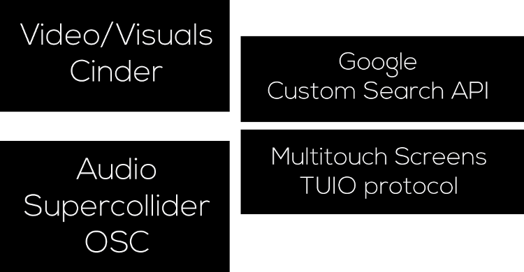

The idea is for the audience to be able to reconstruct o preserve the topology and the physics with hand gestures. Topology is concerned with properties of space and the continuous, dynamic relationships through which space is constituted. We want develop a composition where user interaction, audio, visuals and tecnology collide. 

The idea of the installation is to have the following elements, generative visuals that are going to be made with cinder, audio with supercollider, data retrival with the Custom Search Engine from google and  multitouch screens for user interaction with the piece.

With gesture recognition form a multitouch screen is possible to transform the topology of a mesh. This is a way of making the relationship between real and digital visible.

Using computer-generated geometry we able to transform still images in to dynamic digital sculptures. The still images are going to be obtain from google Custom Search API that provies custom searchs on the web. 

The programming and visuals are going to be using C++/Cinder. The audio is going to be programmed using superCollider. Is very important to have perfect synchronization with the visuals, the audio and interactivity.

