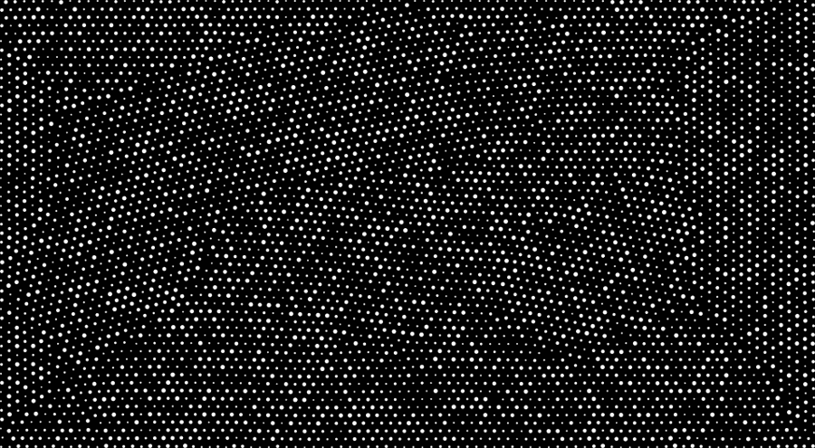

## Particles and Triangulation

The antecedent of the project Manifold, comes form a prototype project named Aether.

First we are going to develop a dynamic particle system in cinder. The particle system has simple interaction forces like repulsion and attraction. But also the particle are render in real time for continues interaction with the user and the sound. Because we need the particle system to be render in real time we going to use Euler Integration to solve the particles positions. Eulers Integration is the fastest method of solving particles positions but not numerical precise as the Runge Kutta method.

We start programming a particle system similar to Memo Akten's MSAPhysics and Daniel Shiffman Particle System. 

Some results after developing the system.
In the following image all the particles have a attraction force to the center. But also all the particle have a small repulsion force. This to have the collision between each of the particle work.

Without the attracting force to the center. A mesh of points

Once having a real time particle system that has interaction forces like repulsion and attraction the next step is feed the points to a Delaunay triangulation algorithm.

We tryed many Delaunay triangulations that are available in the web like polyTri, s-hull, built in cinder triangulation and triangle. The one that worked best for us was [triangle](http://www.cs.cmu.edu/~quake/triangle.html).
The triangulation that we used can execute the Delaunay triangulation of more than 3000 points in real time.

The final output is a mesh of points draw on a canvas. The canvas includes calculating the Delaunay triangulation of a set of points that behave in accordance with the physics simulation.

The ideas is to use the Custom Search API from google to obtain many images as possible and feed this images to the triangulated mesh. The images will only provide the color for each triangle of the mesh. This still images come to life with the hand movement of the participants.

The next step is to feed the 2D mesh with various Textures. The source of the textures are going to be obtain using the Custom Search API from google.
