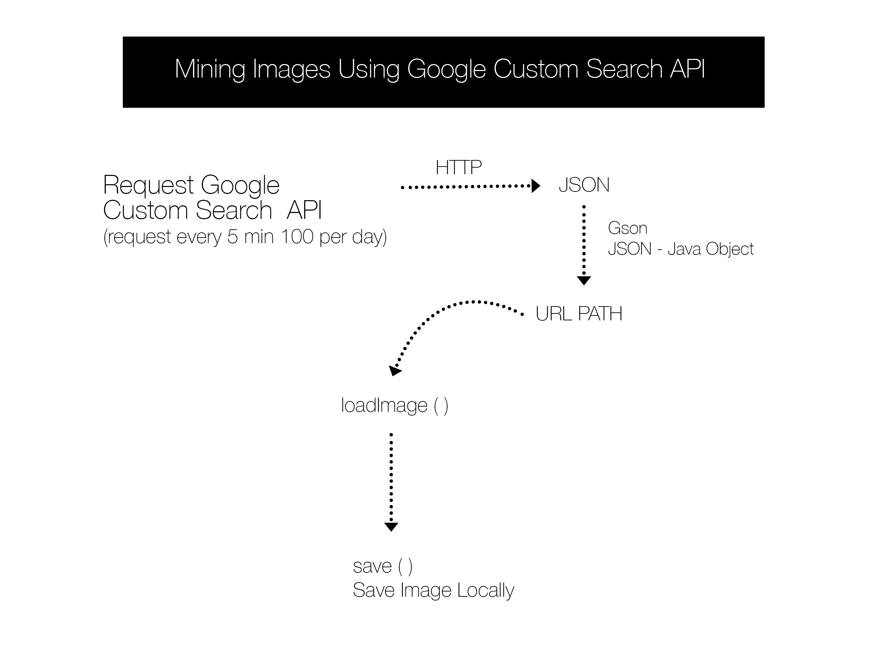

Google Custom Search API lets you search the web programmatically via HTTP request. Once making a request is possible to obtain the information in a JSON format.

We are going to use processing and some external java libraries to achieve our goal of mining custom images from the web. Java provides a set of libraries that lets you connect via HTTP protocol fairly easy.

We start making a simple processing sketch.

First we import all the java libraries like network communication, exception handling and input/output files.

```java
import java.net.*;
import java.net.MalformedURLException;
import java.net.URISyntaxException;
import java.io.Reader.*;
```

The information from the search result is being saved in class called GResults, more about the class check the gitHub link.

```java
void Search()  throws MalformedURLException, URISyntaxException, IOException {

  String key = "";
  String qry = "nebulas"; 
  String cx  = "";
  String fileType = "png,jpg";
  String searchType = "image";

  URL url = new URL ("https://www.googleapis.com/customsearch/v1?key=" +key+ "&cx=" +cx+ "&q=" +qry+"&fileType="+fileType+"&searchType="+searchType+"&alt=json");

  HttpURLConnection conn = (HttpURLConnection) url.openConnection();
  conn.setRequestMethod("GET");
  conn.setRequestProperty("Accept", "application/json");
  BufferedReader br = new BufferedReader(new InputStreamReader ( ( conn.getInputStream() ) ) );
  GResults results = new Gson().fromJson(br, GResults.class);

  conn.disconnect();
}
```
We need to parse the JSON obtain from the search query to java objects. To do this were going to use GSon, a open source java library. With this library is possible to convert JSON to java objects and vise versa. More about Gson [here](https://code.google.com/p/google-gson/)  

We use the following code just to obtain the data from the search result.

```java
  for (int i=0; i < 10; i++) {
    String path  = results.getLink(i)
    loadImage(path);
  }
```
The String `path` will contain the path of the image found from the query,  we only need to retrieve the `path` of the image, this is because we can use a easy built in function from processing called `loadImage(path)`. This function loads images form any given path, it could be a local path or a URL path.




The whole project is located on [github CustomSearchJSON](https://github.com/ThomasLengeling/Processing-Sketch)
