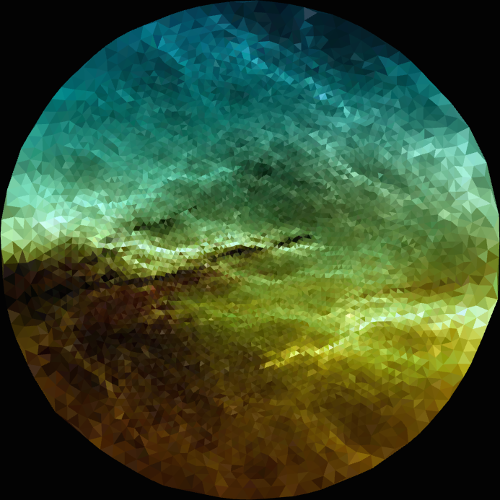
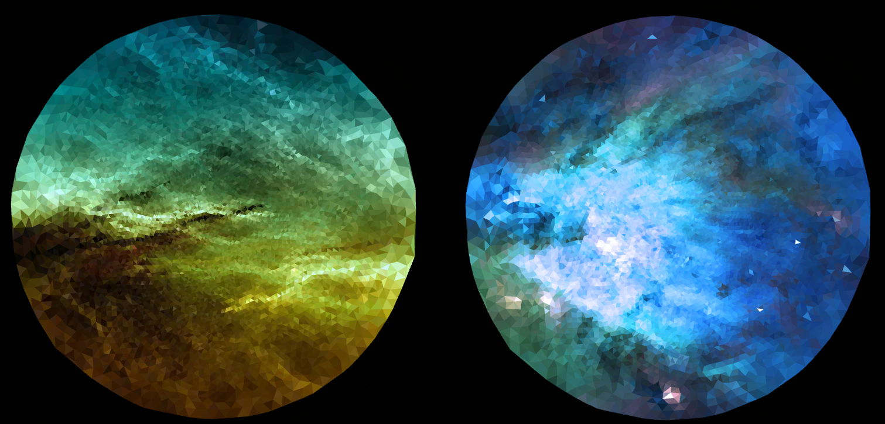
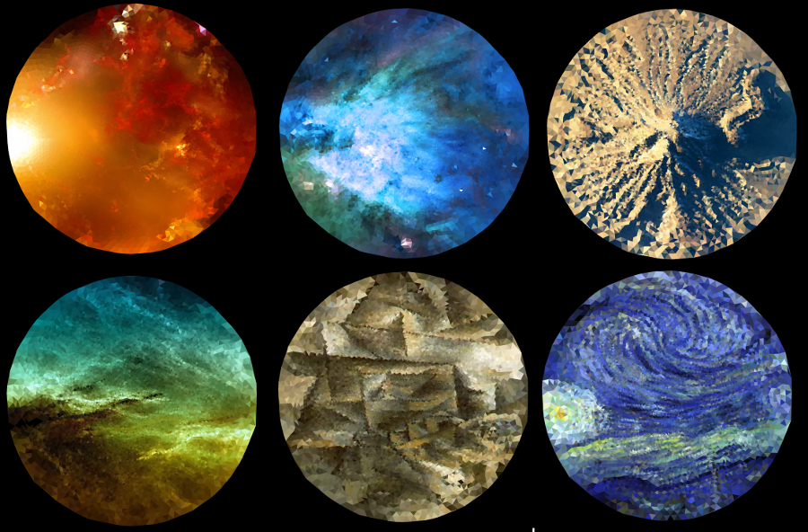

Custom Search JSON/Atom API lets you have up to 100 search queries per day for free, and up 100 pages of search of the same querie.

Some of the queries that were more succsefull in obaning images that could easly be apply to the mesh deformation were.

- Nebula
- Pablo Picasso paintings
- Terrain NASA
- Van Gogh paintings

Most of the images that were were looking for were phorographic still pictures with a lot of change of light and colors.
Some of the seaches needed different parameters in the URL path querie to have a desent image output file. 

Once having obtain a desent amount of images. The images were applyed to mesh that was calculated early back. The triangulated mesh early back is actualy a set of points that are processed into a 2d mesh but with no color. In the following code color is apply to each triangle of the mesh. The function `surfaceColor.getColorPixel(ci::Vec2i)` trows the color of the pixel in that current position.

```c
for(auto it = vAllDelaunayTri.begin(); it != vAllDelaunayTri.end(); ++it){
	Triangle2* t(*it);
	Point2 * p1 = t->getCorner(0);
	Point2 * p2 = t->getCorner(1);
	Point2 * p3 = t->getCorner(2);

	ci::Vec2i center = ci::Vec2i((int)p1->x(), (int)p1->y())/3.0f + 
			   ci::Vec2i((int)p2->x(), (int)p2->y())/3.0f +
			   ci::Vec2i((int)p3->x(), (int)p3->y())/3.0f;

	ci::ColorA col = surfaceColor.getColorPixel(center);

	mMesh.appendVertex( ci::Vec2f(p1->x(), p1->y()) );
	mMesh.appendColorRgba(col);

	mMesh.appendVertex( ci::Vec2f(p2->x(), p2->y()) );
	mMesh.appendColorRgba(col);

	mMesh.appendVertex( ci::Vec2f(p3->x(), p3->y()));
	mMesh.appendColorRgba(col);

	mMesh.appendTriangle( mMesh.getVertices().size()-3, mMesh.getVertices().size()-2, mMesh.getVertices().size()-1 );
}
```









