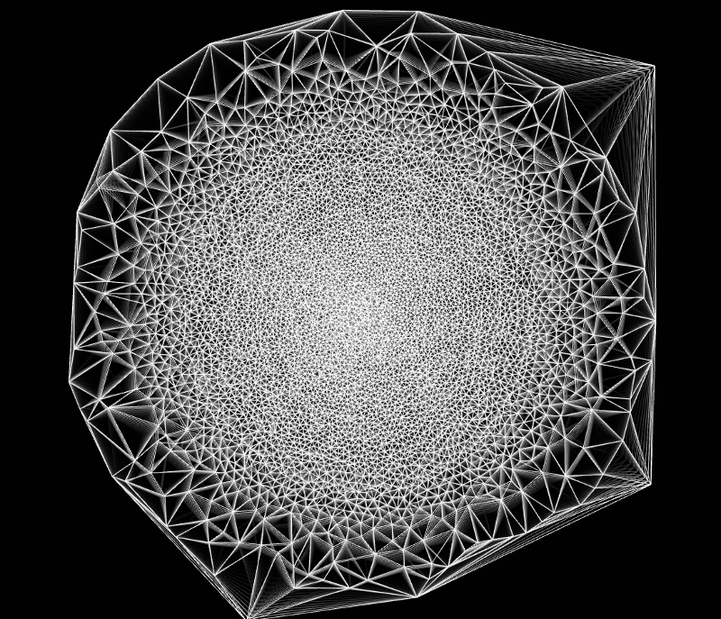
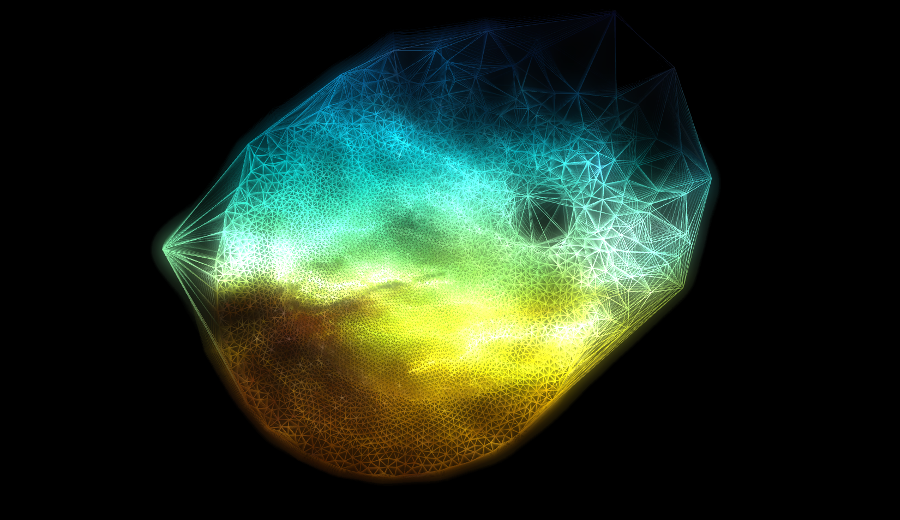

Once having most of the visual achived, now goes the interaction with the user. As we new the particle system that we created has some basic interaction with other particles like attraction and repulsion. We are going to use the attraction as the main interaction with the user. This is because its more easy to relate to also it alters dynamicly all the particles of the system really nicesly. 

So there are two basic funtions to handle the forces.

```c
		particleSystem.addRepulsionForce( posX, posY, radius, force);
		particleSystem.addAttractionForce( posX, posY, radius, force);
```

some of the code for simple mouse interaction
```c
void ManifoldApp::mouseDown( MouseEvent event ){
	isMousePressed = true;
	mouse = Vec2i(event.getPos());
}

void ManifoldApp::mouseUp( MouseEvent event ){
	isMousePressed = false;
}

void ManifoldApp::mouseDrag( MouseEvent event ){
	mouse = Vec2i(event.getPos());
}

void ManifoldApp::update()
{
  ..
  ..
  ..
	if(isMousePressed)
		particleSystem.addRepulsionForce(mouse.x, mouse.y, 70, 5);
	}
```

Some images of the particle system with a repulsive force with a click and drag of the mouse.


->  <-

Now with texture obtain from the mining.



Now also we add a bloom effect to the particles, we ware able to achive this from a post in the cinder forum


