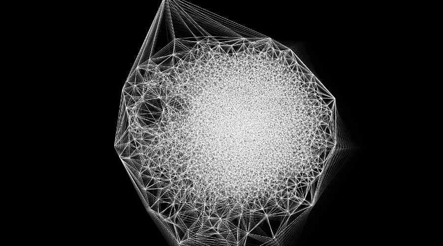
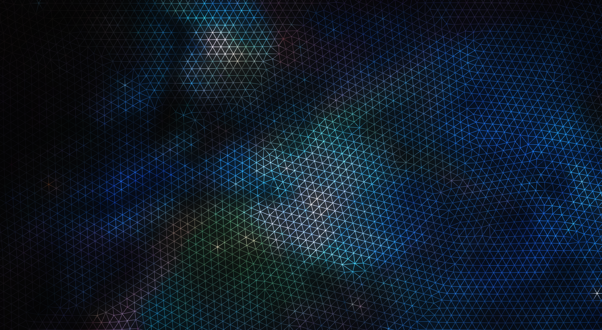

Once having the particle system, Delaunay triangulation and images for the search working simultaneously, we need to be able to interact with the output mesh in real time. As we know the particle system has two type of forces that can be applied, repulsion and attraction.  We are going to use the attraction as the main interaction with the user.  This is because it alters dynamically all the particles of the system really nicely. It also changes the topology of the mesh and the diferent viewpoints that could represent.

So there are two basic functions to handle the forces.

```c
	particleSystem.addRepulsionForce( posX, posY, radius, force);
	particleSystem.addAttractionForce( posX, posY, radius, force);
```
some of the code for simple mouse interaction
```c
void ManifoldApp::mouseDown( MouseEvent event ){
	isMousePressed = true;
	mouse = Vec2i(event.getPos());
}

void ManifoldApp::mouseUp( MouseEvent event ){
	isMousePressed = false;
}

void ManifoldApp::mouseDrag( MouseEvent event ){
	mouse = Vec2i(event.getPos());
}

void ManifoldApp::update()
{
  ..
  ..
  ..
  if(isMousePressed)
	particleSystem.addRepulsionForce(mouse.x, mouse.y, 70, 5);
}
```

The following images are using repulsive force with either a click of the mouse or drag of the mouse.



Now with texture obtain from the mining.


One with no attraction force in the center.



Those images are exposed into a abstract triangulated form which we want the user to be able to manipulate in real time  through hand gestures.


The output is the same object viewed in different perspectives.


