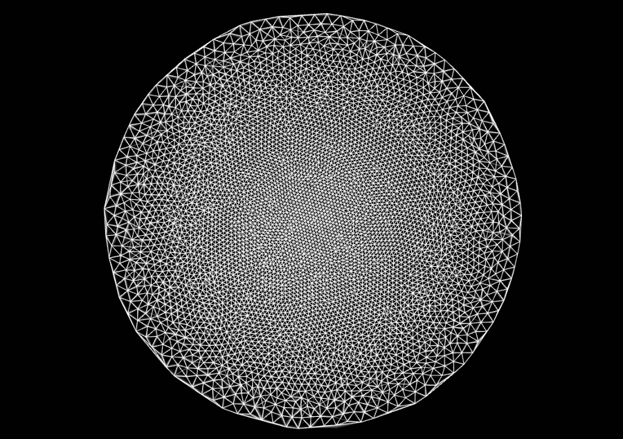

## Prototype

The antecedent of the project Manifold, comes form a prototype project named Aether.

The project Aether uses the following tecnique. The final outout is a canvas that include calculating the Delaunay triangulation that is applied to varios photographic still images thar creates an abstruct sculpt of a 2D mesh. The points obtain from the Delaunay triangulation are feed into a particle system that is beeing process in real time. Like in the following image.

The idea is to feed the colors of the particles and the triangulated delaunay mesh with still images. This still images come to life with the hand movement of the participants. With the interaction of the users they are able to alter the different viewpoints of the images.

http://youtu.be/ZTY43lX5q0I
