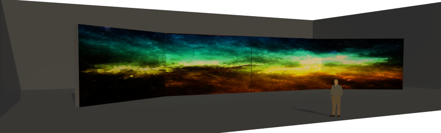

## Interaction 

Video only mouse interaction. The texture of the mesh are obtain from the automatic mining programe made with processig.

[Manifold interaction](https://www.youtube.com/watch?v=LYYt8pbQB-M "Video")

Only some images are showend. But we obtain thousand of open source images from the Custom Search API.

The attendees are able to manipulate the topology and the physics to transform the representation of abstract two dimensional objects into different viewpoints. For this we want to use multitouch screens where eveyone can alter the topology of the mesh and more important the different viewpoints of the images. The idea is for the audience to feel deeply inserted into the piece, for that the installation draws attention to lure you in and invites more people to interact together.

##Room

Ideally the room should be a enclose space. Where almost no illumination is needed, this is because all the illumination is going to be from the projections. The projectors are going to be set up align in a horizontal manner. The ones in the end left and the right end are going to be rotated around 20 degrees like in  following image.

