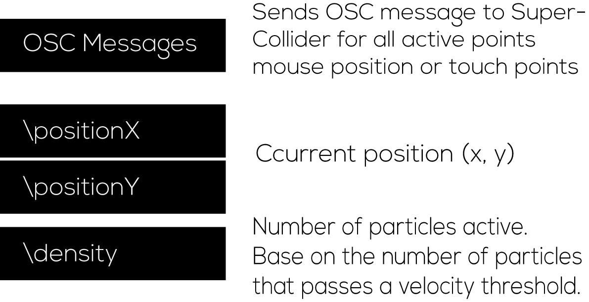

#Audio.

The audio for the installation is being develop using supercollider.

To achieve audio-reactive visuals were going use a library that i'm current colaborating [MIDetectorOSC](https://github.com/beangoben/MIDetectorOSC), which sends musical information to other applications via OSC messages. This is very useful to allow perfect real-time synchronization between audio and video.

Each time there is interaction with the visuals a OSC message is send to supercollider.

the information is normalized between 0 and 1
```c
		osc::Message message;
		message.addFloatArg( lmap<float>(posx, 0, width, 0.0f, 1.0f) );
		message.addFloatArg( lmap<float>(posy, 0, height, 0.0f, 1.0f) );
		message.addFloatArg( lmap<float>(getNumberActiveParticles() 0, numberOfParticles, 0.0f, 1.0f)  );
		message.setAddress("/point"+id);
		message.setRemoteEndpoint(HOST, PORTSEND);
		sender.sendMessage(message);
```



Simple SynthDef and OSCresponder in SuperCollider that react with incoming three parametrs described in previous image.

```sc
~google= Synth(\google);
 
(
o= OSCresponder(nil,"/point1", {|...handr|
   ~equis= handr[2][1];
   ~ye= handr[2][2];
   ~densidad= handr[2][3];
 
   ~google.set(\equis, ~equis.linlin(0,1,100,1000));
   ~google.set(\ye, ~ye.linlin(0,1,0.1,7));
   ~google.set(\densidad, ~ye.linlin(0,1,0.05,25.00));
 
}).add;
```
The idea is for the audience to feel deeply inserted into the piece, for that the installation draws attention to lure you in and invites more people to interact together. To make this happend we need perfect syncronization between user interaction, sound and visuals.


Video with audio interacction.

