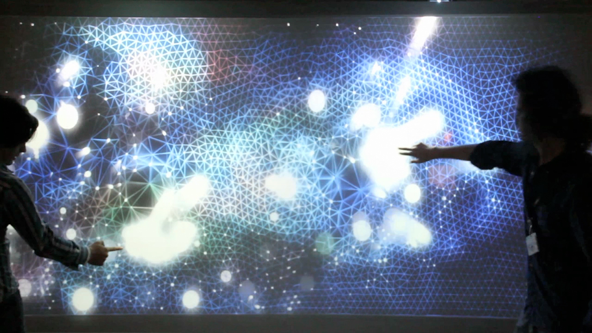

A final test of the application on a multitouch display format.

https://www.youtube.com/watch?v=dp0DZWX-Mf0

The communication between the touch display and Cinder was done using TUIO protocol, it's fairly easy to make the integration of the TUIO protocol in a Cinder project. We need to add three main callback funtions to our cinder project.

```c
void manifoldApp:prepareSettings(Settings *settings){
	settings->enableMultiTouch();
}

void manifoldApp::touchesBegan( TouchEvent event ){
	//add new Point
}

void manifoldApp::touchesMoved( TouchEvent event ){
  //update position
}

void manifoldApp::touchesEnded( TouchEvent event ){
  //update position
}
```

Once having this, we only need to update, add and eliminate the points in the functions that are really similar to mouse events functions.

The installation has the following four elements: visuals, audio, custom search engine and touch interaction.


Manifold describes a continuous dynamic movement of a 2 dimensional euclidian geometry. The geometry is composed by various simple triangles that put together form a complex structure. Each vertex of the triangulation is in a constant motion because each vertex is part of a particle system, so forces like gravity, attraction and repulsion exists. But the color of each vertex is obtained only from a data mining process. With user interaction the piece comes to life.



The final output is a canvas that includes calculating the Delaunay triangulation that is applied to a photographic still obtained from Google Custom Search. The image creates an abstract sculpt of a 2D mesh, which then is fed into a particle system. In particular, this method was employed for interacting multi-cellular systems in Biology and in engineering practices. The presented method allows the definition of a triangulation within a subset of particles attributed to a surface.
