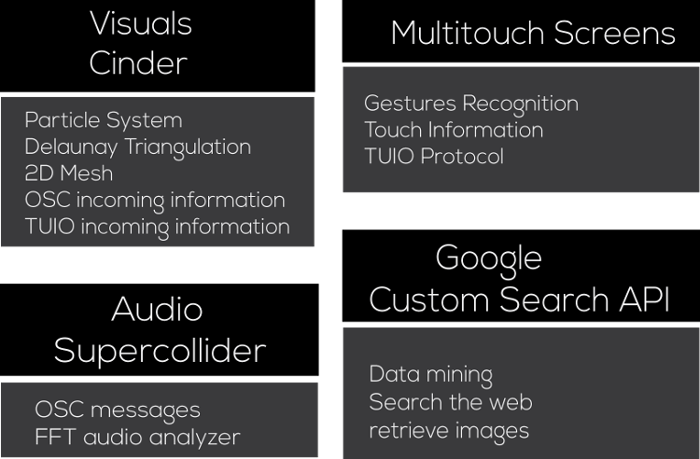

A final test of the aplication on a multitouch display format.

https://www.youtube.com/watch?v=dp0DZWX-Mf0

The comunication bewteen the the touch display an cinder was done using TUIO protocol, its fairly easy to make the integration of TUIO protocol in a Cinder project,

The installation has the following four elements visuals, audio, custom search engine and touch interaction.

Manifold describes a continuos dynamic movement of a 2 dimensional euclidian geometry. The geometry is composed by various simple triangles that put together form a complex structure. Each vertex of the triangulation is in a constant motion because each vertex is part of a particle system, so forces like gravity, attraction and repulsion exists. But the color for earch vertex is obtain only from a data mining process. With user interaction the piece comes to life.
